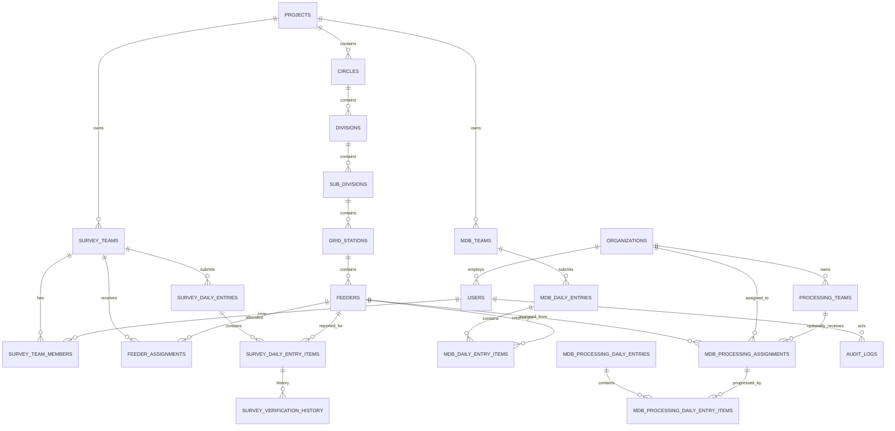

# HAZECO T&D Losses Monitoring System — Architecture

## 1. Decision summary

The application is a modular Laravel monolith with server-rendered, mobile-first Blade screens. Controllers handle HTTP concerns, Form Requests validate input, policies/middleware authorize it, and transaction services own quantity rules. Eloquent models and MySQL are the source of truth. The same services can later be called by `/api/v1` controllers for Flutter without redesigning the database.

Phase 1 stores links to engineering files, never the files themselves. Transactional quantities remain append-only after verification; corrections are privileged, reasoned changes captured by audit records.

### Runtime decision and identified contradictions

- The specification requests the latest stable Laravel and PHP 8.3+. Laravel 13 is current and requires PHP 8.3, but the supplied XAMPP CLI is PHP 8.2.12. This repository therefore uses Laravel 12 as the locally runnable baseline. Production must use PHP 8.3+, and Laravel 13 is the first deployment upgrade gate.
- “Survey reported” excludes returned rows until they are corrected and resubmitted. Otherwise returned work would inflate production.
- Processing assignments reserve created MDB capacity. Active assigned quantity cannot exceed MDB created, preventing the same MDB from being assigned twice.
- “MDB processing backlog” is `created - processed`; “unassigned” is `created - active assigned`. Assignment remaining is reported separately.
- A feeder can bypass the processing completion condition only when its `processing_required` flag is explicitly disabled.

## 2. Component architecture

```text
Browser (Blade, responsive CSS, progressive JS)
        |
Web routes -> Auth / role middleware -> Form Requests -> Controllers
                                                   |
API v1 routes (future Sanctum) --------------------+
                                                   v
               Survey / MDB / Processing / Dashboard services
                                                   |
                                 Policies + database transactions
                                                   |
                              Eloquent models -> MySQL / SQLite(test)
                                                   |
                                   Audit events / notifications / queue
```

Modules are Auth, Administration, Master Data, Survey, Survey Verification, MDB Creation, MDB Processing, Dashboard, Reporting, and Audit.

## 3. ERD



## 4. Table definitions

All tables have unsigned bigint primary keys and timestamps unless stated. Foreign keys are indexed; reporting paths also have composite date/status indexes.

| Table | Important columns | Rules |
|---|---|---|
| organizations | name, type, contact details, status | Internal or third party; soft deletable |
| users | organization_id, name, email, phone, role, status, password | One fixed application role; deactivation blocks login |
| projects | code, name, timezone, processing_required, status | Timezone defaults to Asia/Karachi |
| circles | project_id, code, name | Unique code per project |
| divisions | project_id, circle_id, code, name | Hierarchy enforced by service/UI |
| sub_divisions | project_id, division_id, code, name | Database FK integrity |
| grid_stations | project_id, sub_division_id, code, name | Database FK integrity |
| feeders | all hierarchy FKs, code, name, total_transformers, three Drive URLs, processing_required, status | Baseline and report anchor |
| survey_teams | project_id, name, code, status | Operational team |
| survey_team_members | survey_team_id, user_id, is_leader | Unique membership |
| mdb_teams | project_id, name, code, status | Creation/verification team |
| mdb_team_members | mdb_team_id, user_id | Unique membership |
| processing_teams | project_id, organization_id, name, code, status | Internal or external team |
| processing_team_members | processing_team_id, user_id | Unique membership |
| feeder_assignments | feeder_id, survey_team_id, assigned_by, start/end dates, status | Active allocation controls survey visibility |
| survey_daily_entries | entry_date, survey_team_id, entered_by, status, remarks, submitted_at | Header for one mobile submission |
| survey_daily_entry_items | entry_id, feeder_id, quantity, drive_url, remarks, status, verifier fields, return_reason, resubmitted_at | Row-level verification supports mixed outcomes |
| survey_verification_history | item_id, action, comment, actor, quantity_snapshot | Immutable workflow history |
| mdb_daily_entries | entry_date, mdb_team_id, entered_by, remarks | Creation header |
| mdb_daily_entry_items | entry_id, feeder_id, quantity, drive_url, remarks | Created quantity source |
| mdb_processing_assignments | feeder_id, organization_id, processing_team_id, quantity, assigned/target dates, Drive URL, status, actor | Reserves created capacity |
| mdb_processing_daily_entries | entry_date, organization_id, entered_by, remarks | Processing header |
| mdb_processing_daily_entry_items | entry_id, assignment_id, quantity, output URL, remarks | Processed quantity source |
| audit_logs | user/org, action, auditable type/id, old/new JSON, reason, IP, user agent | Append-only accountability |
| notifications | Laravel UUID notification table | In-app workflow notifications |

Derived totals are not stored. Database summaries can be rebuilt from item rows.

## 5. Relationships and ownership

- Hierarchy ownership is Project → Circle → Division → Sub-Division → Grid Station → Feeder.
- A survey user sees feeders through active `feeder_assignments` to their survey team.
- MDB users see submitted survey rows and verified capacity project-wide, subject to their project team.
- Processing users see active assignments whose `organization_id` equals their user organization. This predicate is always server-side.
- Managers, viewers, and administrators can see all project totals; only permitted operational roles may mutate records.

## 6. Role/permission matrix

| Capability | Super Admin | Project Manager | Survey Leader | MDB User | Processing User | Viewer |
|---|:---:|:---:|:---:|:---:|:---:|:---:|
| Global dashboard/reports | ✓ | ✓ | Own | ✓ | Assigned | ✓ |
| Users/organizations/master data | ✓ | — | — | — | — | — |
| Assign survey feeders | ✓ | ✓ | — | — | — | — |
| Submit/edit returned survey | ✓ | — | ✓ own | — | — | — |
| Verify/return survey | ✓ | — | — | ✓ | — | — |
| Create MDB | ✓ | — | — | ✓ | — | — |
| Assign processing work | ✓ | ✓ | — | — | — | — |
| Submit processing progress | ✓ | — | — | — | ✓ assigned | — |
| Authorized correction with reason | ✓ | ✓ | — | — | — | — |
| Audit log | ✓ | ✓ read | — | — | — | — |

Authorization is enforced by role middleware plus record-level policies/scopes. Menu visibility is a convenience, not a security boundary.

## 7. Workflow and states

```text
Master baseline -> feeder assigned -> survey row SUBMITTED
    -> VERIFIED -> capacity becomes available to MDB
    -> RETURNED -> team edits -> SUBMITTED (history retained)

Verified capacity -> MDB created -> unassigned capacity
    -> processing assignment ACTIVE -> processing daily rows
    -> COMPLETED automatically when processed == assigned
```

Survey headers are `SUBMITTED`, `PARTIALLY_VERIFIED`, `VERIFIED`, or `RETURNED` based on their item states. An item cannot be edited after verification. Assignment cancellation does not delete processing history and is disallowed after progress exists unless handled as an authorized correction.

## 8. Validation and concurrency rules

1. Survey quantity is a positive integer and accepted non-returned survey for a feeder may not exceed its baseline.
2. Survey feeders must be in the user’s active team assignment.
3. Only submitted survey items can be verified or returned; return requires a reason.
4. MDB created quantity is positive and cumulative created may not exceed cumulative verified.
5. Processing assignment quantity is positive and cumulative active assignment may not exceed cumulative MDB created.
6. Processing progress is positive; cumulative progress may not exceed both assignment quantity and feeder MDB created.
7. Third-party organization IDs are derived from the authenticated user/assignment, never trusted from form input.
8. Critical writes run in transactions and lock the feeder or assignment row with `SELECT ... FOR UPDATE`, preventing simultaneous oversubscription.
9. Dates cannot be unreasonably future-dated; display and reporting use the project timezone.
10. Verified/created/processed rows are never deleted by ordinary users.

## 9. Dashboard calculations

| KPI | Formula |
|---|---|
| Total transformers | `SUM(feeders.total_transformers)` |
| Survey reported | `SUM(survey items quantity WHERE status IN submitted,verified)` |
| Survey verified | `SUM(survey items quantity WHERE status=verified)` |
| Survey pending | `MAX(total - reported, 0)` feeder-wise |
| Pending verification | `SUM(quantity WHERE survey status=submitted)` |
| MDB created | `SUM(mdb item quantity)` |
| MDB creation backlog | `MAX(verified - created, 0)` feeder-wise |
| MDB assigned | `SUM(active/completed assignment quantity)` |
| MDB processed | `SUM(processing item quantity)` |
| MDB processing backlog | `MAX(created - processed, 0)` feeder-wise |
| Unassigned MDB | `MAX(created - active assigned, 0)` feeder-wise |
| Assignment remaining | `assigned - processed for assignment` |

Today/week/month filters apply to the date on the respective transaction header. Percentages divide each downstream cumulative total by baseline and safely return zero for an empty baseline.

Feeder status precedence: Completed; Processing Running; MDB Creation Running; Verification Pending; Survey Running; Not Started. Completed requires verified and created to reach baseline, plus processed to reach baseline when processing is required.

## 10. Screen and navigation map

- Dashboard: KPI drill-downs, period cards, four progress bars, trend, feeder table.
- Survey: Add Daily Progress; My Entries; Returned Entries.
- Verification: Pending Survey; verification history.
- MDB Creation: Add Daily MDB; history; backlog.
- MDB Processing: Assign Work; My Assignments; Add Daily Progress; organization performance; backlog.
- Master Data: hierarchy overview; feeders; CSV import; teams; assignments.
- Administration: users; organizations; audit log; settings.
- Reports: daily, overall, geography, teams, returned, creation/processing/backlogs; CSV and print/PDF-friendly output.

## 11. Mobile strategy

- One-column forms below 768px; row repeater cards replace entry tables.
- Inputs are at least 44px high; quantity inputs use `inputmode=numeric`.
- Sticky primary action on operational forms; totals update progressively in the browser but the server recalculates.
- Wide analytical tables are wrapped for desktop and rendered as labeled cards on phones.
- Search/filter controls collapse into a compact drawer; Drive actions remain obvious external links.
- No workflow depends on hover, drag, or horizontal scrolling.

## 12. Laravel structure

```text
app/
  Enums/                 domain states and roles
  Http/Controllers/      thin web/API adapters
  Http/Middleware/       role/status enforcement
  Http/Requests/         validation + request authorization
  Models/                relationships/scopes
  Policies/              record-level authorization
  Services/              transactional domain logic and dashboards
database/
  migrations/ factories/ seeders/
resources/views/
  auth/ dashboard/ survey/ verification/ mdb/ processing/ admin/ reports/
routes/web.php            web UI
routes/api.php            future v1 surface
tests/Feature             workflows/isolation/HTTP
tests/Unit                calculations/status rules
```

## 13. Implementation sequence

1. Runtime configuration, architecture record, schema, models/enums.
2. Authentication, active-user middleware, role gates, policies.
3. Master hierarchy, organizations/users/teams, feeder assignments, import.
4. Survey submission, verification, return/correction/resubmission.
5. MDB creation and capacity validation.
6. Processing assignment, isolation, daily progress.
7. Dashboard queries, trends, feeder/backlog/team views.
8. Audit, notifications, CSV/print reports.
9. Responsive UI and accessibility polish.
10. Factories/seed data, critical concurrency/authorization tests, deployment docs.

## 14. Operational architecture

- Production web root is `/public`; HTTPS, secure cookies, `APP_DEBUG=false`, and trusted proxy settings are mandatory.
- Queue worker runs under a process supervisor; scheduler invokes `php artisan schedule:run` each minute.
- MySQL uses utf8mb4 and regular encrypted backups. Restore drills are part of release operations.
- `config:cache`, `route:cache`, and `view:cache` are built at deploy time. Database migrations run before traffic is shifted.
- Large files remain in Google Drive. Only validated HTTPS URLs/IDs are stored; a storage-link adapter can later integrate the Drive API.

